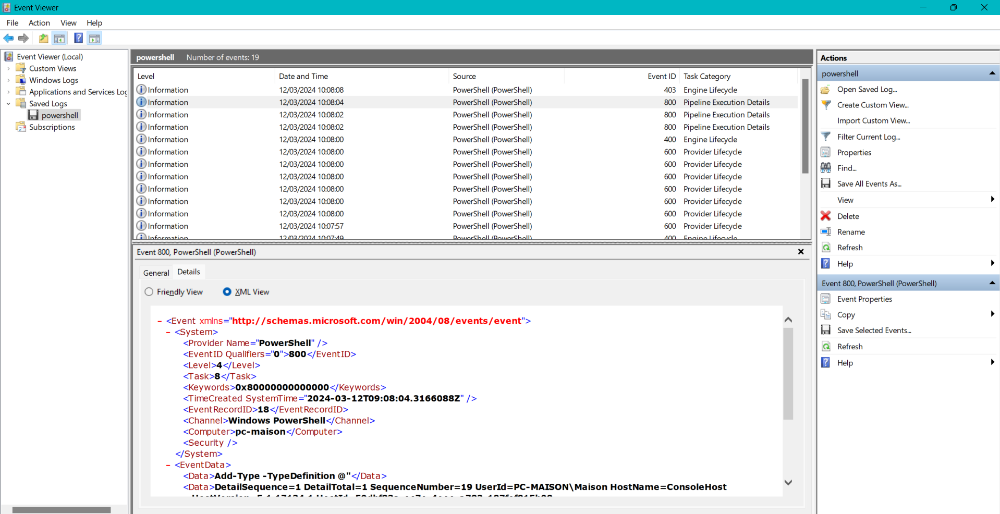

# Vaut mieux sécuriser que guérir

|| |
|-|-|
|Category| Forensics|
|Difficulty| Medium|
|Author|@ElPouleto|

## Description
Lors d'une compétition de lancer de poids, un athlète laisse son ordinateur allumé avec sa session ouverte. Cependant, une personne a utilisé son ordinateur et, a vraisemblablement fait des cachoteries. Nous vous mettons à disposition le dump de la RAM de l'ordinateur après l'incident.
Investiguez ce dump mémoire pour comprendre ce qu'il s'est passé.

La deuxième partie du flag est le nom d'une certaine tâche.
Les deux parties sont séparées d'un tiret "-". Par exemple si le flag de la première partie est "flag1" et celui de la deuxième partie est "flag2". Le réel flag du challenge sera 404CTF{flag1-flag2}

## Solution 

On commence par déterminer l'OS, qu'on identifie rapidement comme étant Windows : 
```sh
vol -f memory.dmp windows.info.Info
```
```
Kernel Base     0xf802724a4000
DTB     0x1aa000
Symbols file:///home/kali/.local/lib/python3.11/site-packages/volatility3/symbols/windows/ntkrnlmp.pdb/039281E5F80D4711858194C121C9D89D-1.json.xz
Is64Bit True
IsPAE   False
layer_name      0 WindowsIntel32e
memory_layer    1 FileLayer
KdVersionBlock  0xf8027284dd50
Major/Minor     15.17134
MachineType     34404
KeNumberProcessors      1
SystemTime      2024-03-12 09:10:11
NtSystemRoot    C:\Windows
NtProductType   NtProductWinNt
NtMajorVersion  10
NtMinorVersion  0
PE MajorOperatingSystemVersion  10
PE MinorOperatingSystemVersion  0
PE Machine      34404
PE TimeDateStamp        Wed Apr 11 04:04:54 2018
```


Le listing des processus nous montre un `powershell.exe`, première piste sur l'exécution d'un script : 
```sh
vol -f memory.dmp windows.pstree.PsTree
```
```
PID	PPID	ImageFileName	Offset(V)	Threads	Handles	SessionId	Wow64	CreateTime	ExitTime

4	0	System	0xd50eb9287440	97	-	N/A	False	2024-03-12 09:57:33.000000 	N/A
* 1832	4	MemCompression	0xd50ebadae580	82	-	N/A	False	2024-03-12 08:57:52.000000 	N/A
* 68	4	Registry	0xd50eb9310040	3	-	N/A	False	2024-03-12 09:57:32.000000 	N/A
* 300	4	smss.exe	0xd50eba852040	2	-	N/A	False	2024-03-12 09:57:33.000000 	N/A
460	444	csrss.exe	0xd50ebabcb240	10	-	1	False	2024-03-12 09:57:36.000000 	N/A
516	444	winlogon.exe	0xd50ebabff080	3	-	1	False	2024-03-12 09:57:36.000000 	N/A
* 680	516	fontdrvhost.ex	0xd50ebb026580	5	-	1	False	2024-03-12 09:57:37.000000 	N/A
* 860	516	dwm.exe	0xd50ebb10c080	13	-	1	False	2024-03-12 09:57:37.000000 	N/A
* 2968	516	userinit.exe	0xd50ebb93e580	0	-	1	False	2024-03-12 08:58:11.000000 	2024-03-12 08:58:40.000000 
** 2528	2968	explorer.exe	0xd50ebb940580	61	-	1	False	2024-03-12 08:58:11.000000 	N/A
*** 4736	2528	OneDriveSetup.	0xd50eb9b7a580	0	-	1	True	2024-03-12 09:00:13.000000 	2024-03-12 09:03:45.000000 
*** 4612	2528	fsquirt.exe	0xd50eba11d580	0	-	1	False	2024-03-12 09:00:02.000000 	2024-03-12 09:00:02.000000 
*** 3432	2528	unregmp2.exe	0xd50ebb9f1580	0	-	1	False	2024-03-12 08:58:14.000000 	2024-03-12 08:58:14.000000 
*** 5512	2528	MSASCuiL.exe	0xd50eb9aef580	1	-	1	False	2024-03-12 09:00:12.000000 	N/A
*** 1012	2528	FirstLogonAnim	0xd50ebb972300	0	-	1	False	2024-03-12 08:58:11.000000 	2024-03-12 08:59:58.000000 
*** 3668	2528	unregmp2.exe	0xd50ebba91580	0	-	1	False	2024-03-12 08:58:15.000000 	2024-03-12 08:58:15.000000 
*** 4852	2528	powershell.exe	0xd50eb9707080	13	-	1	False	2024-03-12 09:07:46.000000 	N/A
**** 4544	4852	conhost.exe	0xd50ebbd88580	4	-	1	False	2024-03-12 09:07:46.000000 	N/A
*** 3452	2528	ie4uinit.exe	0xd50ebb9f4580	0	-	1	False	2024-03-12 08:58:14.000000 	2024-03-12 08:58:15.000000 
5168	3664	SystemSettings	0xd50eb9b33580	3	-	1	False	2024-03-12 09:00:48.000000 	N/A
904	3600	OneDrive.exe	0xd50eba0ee580	17	-	1	True	2024-03-12 09:04:03.000000 	N/A
```


On peut aller voir avec quels arguments a été appelé PowerShell. La commande précédente nous fournit le PID associé, `4852`, ce qui va nous permettre de préciser nos recherches : 

```sh
vol -f memory.dmp windows.cmdline.CmdLine --pid 4852
```
```
PID     Process Args

4852    powershell.exe  "C:\Windows\system32\WindowsPowerShell\v1.0\PowerShell.exe" 
```


Pas de chemin vers un script à exécuter dans les arguments. Peut-être que la console a été ouverte manuellement afin d'exécuter des commandes dessus ? Si oui, on a peut-être moyen de les retrouver dans l'historique. Par défaut, le fichier d'historique est localisé dans `%userprofile%\AppData\Roaming\Microsoft\Windows\PowerShell\PSReadline\ConsoleHost_history.txt`.


Lançons un filescan pour voir les fichiers présents dans le dump. On peut stocker les résultats dans un fichier pour la suite : 

```sh
vol -f memory.dmp windows.filescan.FileScan > filescan.txt
grep ConsoleHost_history.txt filescan.txt
```
```
0xd50ebb98a080  \Users\Maison\AppData\Roaming\Microsoft\Windows\PowerShell\PSReadline\ConsoleHost_history.txt   216
```


Le fichier a l'air présent ! On peut récupérer son contenu grâce au plugin `DumpFiles` et à l'adresse mémoire associée :

```sh
vol -f memory.dmp windows.dumpfiles.DumpFiles --virtaddr 0xd50ebb98a080
```
```
Cache   FileObject      FileName        Result

DataSectionObject       0xd50ebb98a080  ConsoleHost_history.txt file.0xd50ebb98a080.0xd50eb945d010.DataSectionObject.ConsoleHost_history.txt.dat
```
```sh
cat file.0xd50ebb98a080.0xd50eb945d010.DataSectionObject.ConsoleHost_history.txt.dat
```
```
rm hacked.ps1 
```


Visiblement, le script `hacked.ps1` a été supprimé du système, nous ne pourrons pas récupérer son contenu avec `DumpFiles` comme précédemment. On peut tenter de voir ce qui ressort avec `strings` : 

```sh
strings memory.dmp | grep "hacked.ps1"
```
```
"C:\Windows\System32\WindowsPowerShell\v1.0\powershell.exe" .\hacked.ps1
\hacked.ps1
powershell .\hacked.ps1
powershell .\hacked.ps1
rm hacked.ps1
drm hacked.ps1
rm hacked.ps1
rm hacked.ps1
wsPowerShell\v1.0\powershell.exe" .\hacked.ps1
GET /hacked.ps1 HTTP/1.1
"C:\Windows\System32\WindowsPowerShell\v1.0\powershell.exe" .\hacked.ps1
"C:\Windows\System32\WindowsPowerShell\v1.0\powershell.exe" .\hacked.ps1
```

Le script `hacked.ps1` a bien l'air d'avoir été exécuté sur la machine, d'après les lignes `"C:\Windows\System32\WindowsPowerShell\v1.0\powershell.exe" .\hacked.ps1` (on s'en doutait, mais bon). Si le script a été exécuté, on peut en trouver des traces dans les journaux d'evénements Windows. Ces fichiers ont pour extension `.evtx`, et listent toutes sortes d'événements liés à l'activité du système. Les evénements ont un XML associé qui décrit leurs propriétés. 


On peut lister quels journaux sont potentiellement présents dans le dump grâce à notre précédent filescan : 
```sh
grep -i ".*powershell.*\.evtx" filescan.txt
```
```
0xd50eb9a3ed60  \Windows\System32\winevt\Logs\Microsoft-Windows-PowerShell%4Admin.evtx  216
0xd50ebaced3a0  \Windows\System32\winevt\Logs\Windows PowerShell.evtx   216
0xd50ebbf60720  \Windows\System32\winevt\Logs\Microsoft-Windows-PowerShell%4Operational.evtx    216
```

On récupère le contenu de ces 3 fichiers grâce à `Dumpfiles` : 
```sh
vol -f memory.dmp windows.dumpfiles.DumpFiles --virtaddr 0xd50eb9a3ed60
```
```
Cache   FileObject      FileName        Result

DataSectionObject       0xd50eb9a3ed60  Microsoft-Windows-PowerShell%4Admin.evtx        file.0xd50eb9a3ed60.0xd50ebbbee760.DataSectionObject.Microsoft-Windows-PowerShell%4Admin.evtx.dat
```
```sh
vol -f memory.dmp windows.dumpfiles.DumpFiles --virtaddr 0xd50ebaced3a0
```
```
Cache   FileObject      FileName        Result

DataSectionObject       0xd50ebaced3a0  Windows PowerShell.evtx file.0xd50ebaced3a0.0xd50ebaceea70.DataSectionObject.Windows PowerShell.evtx.dat
SharedCacheMap  0xd50ebaced3a0  Windows PowerShell.evtx file.0xd50ebaced3a0.0xd50ebaceebb0.SharedCacheMap.Windows PowerShell.evtx.vacb
```
```sh
vol -f memory.dmp windows.dumpfiles.DumpFiles --virtaddr 0xd50ebbf60720
```
```
Cache   FileObject      FileName        Result

DataSectionObject       0xd50ebbf60720  Microsoft-Windows-PowerShell%4Operational.evtx  Error dumping file
SharedCacheMap  0xd50ebbf60720  Microsoft-Windows-PowerShell%4Operational.evtx  file.0xd50ebbf60720.0xd50eb9c93500.SharedCacheMap.Microsoft-Windows-PowerShell%4Operational.evtx.vacb
```

On va se contenter de retravailler les fichiers `.dat` par la suite, afin de les exploiter dans un outil d'analyse de journaux :
```sh
mv "file.0xd50ebbf60720.0xd50eb9615a40.DataSectionObject.Microsoft-Windows-PowerShell%4Operational.evtx.dat" powershell_operational.evtx
mv "file.0xd50eb9a3ed60.0xd50ebbbee760.DataSectionObject.Microsoft-Windows-PowerShell%4Admin.evtx.dat" powershell_admin.evtx
mv "file.0xd50ebaced3a0.0xd50ebaceea70.DataSectionObject.Windows PowerShell.evtx.dat" powershell.evtx
```

Pour l'analyse, on peut directement ouvrir les fichiers dans l'outil "Event Viewer" de Windows. On y voit alors la liste des evénements et leur contenu. Vu que les fichiers ne sont pas très gros, on peut tout à fait s'en sortir en explorant leur contenu à la main :


On peut aussi passer par la commande PowerShell [`Get-WinEvent`](https://learn.microsoft.com/fr-fr/powershell/module/microsoft.powershell.diagnostics/get-winevent?view=powershell-7.4). Cette commande permet de faire des requêtes dans les journaux d'événements, ce qui est une méthode un peu plus scalable en présence de gros fichiers.

Par défaut, `Get-WinEvent` renvoie une liste d'objets [`EventLogRecord`](https://learn.microsoft.com/fr-fr/dotnet/api/system.diagnostics.eventing.reader.eventlogrecord?view=net-8.0). On se sert de la doc pour connaître les propriétés de ces objets. La commande ci-dessous nous permet de lister tous les types d'événements rencontrés dans nos fichier de logs :

```powershell
Get-WinEvent -Path ".\*.evtx" | Select-Object -Property ProviderName, Id, TaskDisplayName | Sort-Object -Property Id | Get-Unique -AsString
```
```
ProviderName                    Id TaskDisplayName
------------                    -- ---------------
PowerShell                     400 Engine Lifecycle
PowerShell                     403 Engine Lifecycle
PowerShell                     600 Provider Lifecycle
PowerShell                     800 Pipeline Execution Details
Microsoft-Windows-PowerShell  4103 Executing Pipeline
Microsoft-Windows-PowerShell  4104 Execute a Remote Command
Microsoft-Windows-PowerShell 40961 PowerShell Console Startup
Microsoft-Windows-PowerShell 40962 PowerShell Console Startup
Microsoft-Windows-PowerShell 53504 PowerShell Named Pipe IPC
```

Les événements les plus intéressants pour nous sont ceux qui ont pour ID `4104` et qui correspondent à l'exécution de commandes PowerShell. On peut faire un premier filtre XPath pour isoler ces derniers et afficher le contenu de `EventData`

```powershell
Get-WinEvent -Path ".\*.evtx" -FilterXPath '*/System/EventID=4104' | Foreach-Object {
    [xml]$xml = $_.ToXml()
    $data_nodes = $xml.Event.EventData.ChildNodes
    Write-Output $data_nodes 
}
```
```
Name            #text
----            -----
MessageNumber   4
MessageTotal    4
ScriptBlockText esent = $__cmdletization_defaultValueIsPresent}...
ScriptBlockId   a72c82d3-a1ec-449c-8301-016032ddcf74
Path

...

MessageNumber   1
MessageTotal    1
ScriptBlockText ...
ScriptBlockId   6adc14cc-00ef-40ee-91c6-8523c7c10662
Path
MessageNumber   1
MessageTotal    1
ScriptBlockText #########################################################################################################...
ScriptBlockId   7a4318a5-8a16-4fea-91db-595dc4732770
Path            C:\Users\Maison\hacked.ps1
```

Le dernier événement de la liste est lié au fichier `hacked.ps1` ! On peut récupérer son contenu avec une dernière requête :

```powershell
Get-WinEvent -Path ".\*.evtx" -FilterXPath '*/EventData/Data[@Name="ScriptBlockId"]="7a4318a5-8a16-4fea-91db-595dc4732770"' | Foreach-Object {
    [xml]$xml = $_.ToXml()
    $script = $xml.Event.EventData.Data | Where-Object {$_.Name -eq "ScriptBlockText"}
    Write-Output $script.InnerText | Out-File hacked.ps1
```

En regardant le contenu du fichier `hacked.ps1`, on trouve plusieurs indices pour notre flag : 
- la partie 1 du flag, dissimulée dans une image nommée `thumbcache0`. Elle est présente dans le dump et peut être récupérée avec `DumpFiles`, ou alors on peut regarder comment le script produit l'image pour retrouver son contenu. La partie qui nous intéresse est ajoutée à la ligne 291 :
```powershell
$textSize = $graphics.MeasureString("e1ByQG5rM2Qt`n" + $content, $font)
```
- la partie 2 du flag, qui est le nom d'une tâche. On trouve la création d'une tâche planifiée `LUL` à la ligne 448
```powershell
Register-ScheduledTask -Action $Action -Trigger $Trigger -TaskName "LUL"
```

## Flag
`404CTF{e1ByQG5rM2Qt-LUL}`
